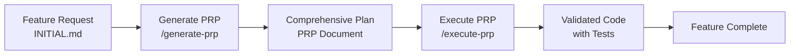

# MetaAds Context Engineering Setup Complete 🎯

## What We've Accomplished

### 1. Project Structure Enhancement
```
metaads/
├── .claude/                    ✅ AI Configuration
│   ├── commands/              
│   │   ├── generate-prp.md    ✅ PRP Generation Command
│   │   └── execute-prp.md     ✅ PRP Execution Command
│   └── settings.local.json    ✅ Permissions
├── PRPs/                      ✅ Product Requirements Prompts
│   ├── templates/             
│   │   └── prp_base.md        ✅ Base Template
│   └── dashboard_quick_stats_prp.md ✅ Example PRP
├── examples/                  ✅ Code Patterns
│   ├── api-route-pattern.ts   ✅ API Pattern
│   ├── component-pattern.tsx  ✅ Component Pattern
│   ├── database-pattern.ts    ✅ Database Pattern
│   └── README.md             ✅ Pattern Guide
├── CLAUDE.md                  ✅ Project Rules
├── INITIAL.md                 ✅ Feature Template
├── INITIAL_QUICK_STATS.md     ✅ Example Feature
└── README.md                  ✅ Updated with Workflow
```

### 2. Development Environment
- ✅ Dependencies installed
- ✅ Development server running at http://localhost:3000
- ✅ Basic .env configuration created
- ⚠️  Database setup pending (needs PostgreSQL)

### 3. Context Engineering Workflow



### 4. Key Benefits Demonstrated

1. **Comprehensive Context**: Every AI interaction has full project context
2. **Consistent Patterns**: Examples ensure code follows established patterns
3. **Validation-Driven**: Each step includes validation commands
4. **Reduced Errors**: Detailed PRPs prevent common implementation mistakes
5. **Faster Development**: Clear blueprints speed up implementation

## How to Use This Setup

### For New Features:
1. Copy `INITIAL.md` and describe your feature
2. Run `/generate-prp` to create implementation plan
3. Review the generated PRP
4. Run `/execute-prp` to implement with validation
5. Test and deploy

### For Bug Fixes:
1. Use existing patterns from `examples/`
2. Follow conventions in `CLAUDE.md`
3. Run validation commands before committing

### For Code Reviews:
1. Check against patterns in `examples/`
2. Ensure PRPs were followed
3. Verify validation steps completed

## Next Steps for Full Setup

1. **Database Setup**:
   ```bash
   # Option 1: Docker PostgreSQL
   docker run --name metaads-db -e POSTGRES_PASSWORD=password -p 5432:5432 -d postgres
   
   # Option 2: Use Supabase
   # Create project at supabase.com and update .env
   ```

2. **Complete Environment**:
   - Add real Facebook App credentials
   - Configure Meta Ads API access
   - Set up AI provider API keys

3. **Test the Workflow**:
   - Execute the Quick Stats PRP
   - See the feature in action
   - Iterate based on results

## Resources

- **Context Engineering Intro**: https://github.com/coleam00/context-engineering-intro
- **MetaAds Requirements**: See `requirements/` directory
- **Facebook OAuth Setup**: See `docs/facebook-oauth-setup.md`

---

The MetaAds project is now equipped with a powerful context engineering system that ensures reliable, high-quality AI-assisted development! 🚀