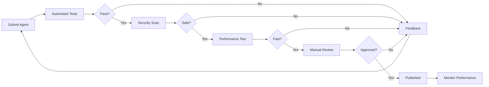

# AgentOS Marketplace Strategy

## Executive Summary

The AgentOS Marketplace will be the "App Store for AI Agents" - a thriving ecosystem where developers create and monetize agents while businesses discover solutions for any automation need.

## Marketplace Vision

**"Every business process automated by an AI agent, available in one click"**

### Key Principles
1. **Quality over Quantity**: Curated, high-quality agents only
2. **Developer Success**: Generous revenue sharing and support
3. **Business Value**: Clear ROI for every agent
4. **Trust & Safety**: Verified developers and secure agents
5. **Network Effects**: More agents → more users → more developers

## Marketplace Structure

### 1. Agent Categories

```
📊 Sales & Marketing
├── Lead Generation Agent
├── Email Outreach Agent
├── Social Media Manager Agent
├── Content Creation Agent
└── Campaign Optimizer Agent

💼 Operations & Finance
├── Invoice Processing Agent
├── Expense Analyzer Agent
├── Inventory Manager Agent
├── Supply Chain Agent
└── Financial Reporter Agent

🎯 Customer Success
├── Support Ticket Agent
├── Customer Onboarding Agent
├── Feedback Analyzer Agent
├── Churn Prevention Agent
└── Upsell Assistant Agent

👥 HR & Recruiting
├── Resume Screener Agent
├── Interview Scheduler Agent
├── Onboarding Assistant Agent
├── Performance Review Agent
└── Employee Engagement Agent

🔧 IT & Engineering
├── Code Review Agent
├── Bug Triage Agent
├── Security Scanner Agent
├── Documentation Agent
└── DevOps Assistant Agent

📈 Analytics & Insights
├── Data Analyst Agent
├── Report Generator Agent
├── Dashboard Builder Agent
├── Anomaly Detector Agent
└── Forecasting Agent
```

### 2. Monetization Models

#### For Developers
```typescript
interface RevenueModel {
  // Transaction-based
  marketplace_fee: 0.30, // 30% to platform
  developer_share: 0.70, // 70% to developer
  
  // Subscription tiers
  pricing_options: {
    free: { 
      executions: 100,
      features: 'basic'
    },
    pro: {
      price: 49,
      executions: 1000,
      features: 'advanced'
    },
    enterprise: {
      price: 'custom',
      executions: 'unlimited',
      features: 'full'
    }
  },
  
  // Additional revenue streams
  support_packages: true,
  custom_development: true,
  training_materials: true
}
```

#### For AgentOS
- **Transaction Fees**: 30% of all marketplace transactions
- **Premium Listings**: $99/month for featured placement
- **Certification Program**: $299 per developer
- **Enterprise Support**: Custom contracts
- **Data Insights**: Anonymized usage data licensing

### 3. Developer Program

#### Tiers
1. **Community Developer** (Free)
   - Publish up to 3 agents
   - Basic analytics
   - Community support

2. **Professional Developer** ($49/month)
   - Unlimited agents
   - Advanced analytics
   - Priority support
   - Beta features

3. **Enterprise Partner** (Custom)
   - White-label options
   - Direct support
   - Co-marketing
   - Revenue guarantees

#### Benefits
- **Development Tools**
  - AgentOS SDK
  - Testing framework
  - Local runtime
  - VS Code extension

- **Marketing Support**
  - Featured listings
  - Blog posts
  - Case studies
  - Conference speaking

- **Technical Support**
  - Dedicated Slack channel
  - Office hours
  - Code reviews
  - Architecture guidance

## Go-to-Market Strategy

### Phase 1: Seed the Marketplace (Month 1-2)

#### Internal Development (20 agents)
```python
# Core agents to build internally
SEED_AGENTS = [
    # Showcase technical capabilities
    "CustomerSupportAgent",      # Handle tickets with 90% accuracy
    "SalesOutreachAgent",        # 3x email response rates
    "DataAnalystAgent",          # Natural language to insights
    "ContentCreatorAgent",       # Blog posts, social media
    "ExpenseManagerAgent",       # OCR + categorization
    
    # Migration from MetaAds
    "MetaAdsCampaignAgent",      # Our expertise
    "AdCreativeAgent",           # AI-generated ads
    "AdOptimizationAgent",       # Budget optimization
    "AnalyticsReporterAgent",    # Performance insights
    "CompetitorAnalysisAgent",   # Market intelligence
]
```

#### Strategic Partnerships (10 agents)
- **Zapier**: Integration specialist agents
- **HubSpot**: CRM automation agents
- **Stripe**: Payment processing agents
- **Slack**: Communication agents
- **Google**: Workspace automation agents

### Phase 2: Developer Acquisition (Month 3-4)

#### Developer Incentives
1. **Launch Bonus**: $5,000 for first 50 developers
2. **Revenue Guarantee**: $1,000/month for 3 months
3. **Marketing Credits**: $500 in featured listings
4. **Swag Package**: Exclusive developer kit

#### Hackathons
- **AgentOS Challenge**: $50,000 prize pool
- **Categories**: Most innovative, highest ROI, best UX
- **Timeline**: 48-hour virtual hackathon
- **Outcome**: 50+ new agents

### Phase 3: User Acquisition (Month 5-6)

#### Target Segments
1. **Early Adopters**
   - Tech startups
   - Digital agencies
   - E-commerce businesses
   - SaaS companies

2. **Expansion Markets**
   - Professional services
   - Healthcare practices
   - Real estate agencies
   - Educational institutions

#### Acquisition Channels
- **Content Marketing**: "How AI Agents Saved X Hours"
- **Webinars**: Live agent building demos
- **Partnerships**: Integrate with business tools
- **Influencers**: Tech YouTubers and podcasters
- **Free Tier**: 5 agents free forever

## Quality Assurance

### Agent Certification Process



### Quality Metrics
- **Success Rate**: >90% execution success
- **Performance**: <2s average execution time
- **Security**: No data leaks or vulnerabilities
- **Documentation**: Complete API docs and examples
- **Support**: <24h response time

## Success Metrics

### Year 1 Goals

| Metric | Q1 | Q2 | Q3 | Q4 |
|--------|----|----|----|----|
| Total Agents | 30 | 100 | 500 | 1000 |
| Active Developers | 10 | 50 | 200 | 500 |
| Monthly Active Users | 100 | 1K | 10K | 50K |
| GMV (Monthly) | $10K | $100K | $500K | $2M |
| Platform Revenue | $3K | $30K | $150K | $600K |

### Long-term Vision (3 Years)
- **10,000+ agents** in marketplace
- **$100M+ GMV** annually
- **1M+ businesses** using agents
- **10K+ developers** earning income
- **Category leader** in business automation

## Competitive Moat

### Network Effects
```
More Agents → More Users → More Data → Better Agents → More Developers → More Agents
```

### Data Advantage
- **Usage Analytics**: Which agents solve real problems
- **Performance Data**: Optimization opportunities
- **Integration Patterns**: Common tool combinations
- **Industry Insights**: Vertical-specific needs

### Platform Lock-in
- **State Management**: Historical data in platform
- **Integrations**: Deep connections to business tools
- **Workflows**: Multi-agent orchestrations
- **Team Training**: Institutional knowledge

## Marketing Strategy

### Content Marketing
1. **Blog Series**: "Agent of the Week" showcases
2. **Video Tutorials**: Building agents from scratch
3. **Case Studies**: ROI stories from customers
4. **Documentation**: Best-in-class developer docs

### Community Building
1. **Discord Server**: 24/7 developer community
2. **Monthly Meetups**: Virtual agent building sessions
3. **Annual Conference**: AgentOS Summit
4. **Certification Program**: Become a certified developer

### Partnership Marketing
1. **Tool Integrations**: "Works with AgentOS" badge
2. **Consultancy Network**: Implementation partners
3. **Education**: University partnerships
4. **Open Source**: Core libraries on GitHub

## Risk Mitigation

### Quality Risks
- **Bad Agents**: Strict certification process
- **Copycats**: IP protection and rapid innovation
- **Support Burden**: Self-service resources

### Business Risks
- **Slow Adoption**: Free tier and guarantees
- **Developer Churn**: Revenue sharing and support
- **Competition**: Fast execution and moat building

### Technical Risks
- **Scaling**: Cloud-native architecture
- **Security**: Sandboxing and reviews
- **Reliability**: SLAs and monitoring

## Investment Requirements

### Marketplace Development
- **Engineering**: $1M (10 engineers for 6 months)
- **Developer Relations**: $500K (team of 5)
- **Marketing**: $1M (launch campaign)
- **Operations**: $500K (support and QA)

### Total: $3M for marketplace launch

## Conclusion

The AgentOS Marketplace will transform how businesses automate their operations. By creating a thriving ecosystem of developers and users, we'll build a sustainable platform that generates value for all stakeholders while establishing AgentOS as the leader in business AI automation.

**Next Steps**:
1. Hire VP of Marketplace
2. Build developer relations team
3. Create first 10 internal agents
4. Launch developer preview program
5. Sign 5 strategic partnerships