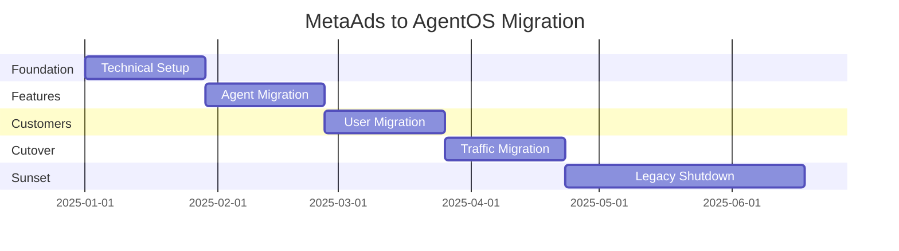

# MetaAds → AgentOS Migration Plan

## Executive Summary

This document outlines the migration strategy from MetaAds (single-purpose ad platform) to AgentOS (universal AI agent platform) while maintaining business continuity and preserving existing customer value.

## Migration Principles

1. **Zero Downtime**: Existing MetaAds customers experience no service interruption
2. **Feature Parity Plus**: All MetaAds features available in AgentOS with enhancements
3. **Gradual Transition**: Phased approach over 6 months
4. **Customer Choice**: Users can opt-in to new features at their pace
5. **Data Integrity**: Complete preservation of historical data and settings

## Phase 1: Foundation (Weeks 1-4)

### Technical Setup
```bash
# Repository structure
metaads/                    # Current system
├── src/                   # Existing Next.js app
├── agents/                # Current Python agents
└── ...

agentos/                   # New system  
├── apps/
│   ├── web/              # Next.js frontend
│   └── legacy-bridge/    # MetaAds compatibility layer
├── services/
│   ├── langgraph/        # Agent runtime
│   ├── marketplace/      # New marketplace service
│   └── auth/            # Shared auth service
└── packages/
    ├── shared-ui/       # Shared components
    └── sdk/            # AgentOS SDK
```

### Database Migration Strategy
```sql
-- Add AgentOS tables alongside MetaAds tables
CREATE SCHEMA agentos;

-- User mapping table
CREATE TABLE agentos.user_migrations (
  metaads_user_id UUID REFERENCES public.users(id),
  agentos_org_id UUID,
  migration_status VARCHAR(50) DEFAULT 'pending',
  migrated_at TIMESTAMP
);

-- Preserve all MetaAds data
CREATE TABLE agentos.legacy_campaigns AS 
SELECT * FROM public.campaigns;
```

### Code Sharing
```typescript
// shared-auth/auth.config.ts
export const authConfig = {
  providers: [
    // Shared Facebook OAuth
    FacebookProvider({
      clientId: process.env.FACEBOOK_APP_ID,
      clientSecret: process.env.FACEBOOK_APP_SECRET,
    })
  ],
  // Share session between apps
  cookies: {
    sessionToken: {
      name: `auth.session-token`,
      options: {
        httpOnly: true,
        sameSite: 'lax',
        path: '/',
        secure: true,
        domain: '.agentos.ai' // Shared domain
      }
    }
  }
}
```

## Phase 2: Feature Migration (Weeks 5-8)

### MetaAds Features as AgentOS Agents

#### 1. Campaign Creation Agent
```python
# agentos/agents/meta-ads/campaign_creator.py
from langgraph.graph import StateGraph
from legacy.metaads import CampaignCreator as LegacyCreator

class MetaAdsCampaignAgent:
    """Backward compatible campaign creation agent"""
    
    def __init__(self):
        self.legacy_creator = LegacyCreator()
        
    async def create_campaign(self, state):
        # Use existing logic
        result = await self.legacy_creator.create(state["campaign_data"])
        
        # Enhance with new capabilities
        state["campaign_id"] = result["id"]
        state["optimization_suggestions"] = self.analyze_campaign(result)
        
        return state
```

#### 2. Migration API
```typescript
// apps/web/api/migration/route.ts
export async function POST(req: Request) {
  const { metaAdsUserId } = await req.json()
  
  // 1. Fetch MetaAds data
  const userData = await fetchMetaAdsUser(metaAdsUserId)
  const campaigns = await fetchMetaAdsCampaigns(metaAdsUserId)
  const connections = await fetchMetaConnections(metaAdsUserId)
  
  // 2. Create AgentOS organization
  const org = await createOrganization({
    name: userData.company || `${userData.name}'s Organization`,
    owner: userData.email
  })
  
  // 3. Migrate campaigns as workflow templates
  for (const campaign of campaigns) {
    await createWorkflowTemplate({
      name: `Meta Ads: ${campaign.name}`,
      type: 'meta_ads_campaign',
      config: campaign,
      orgId: org.id
    })
  }
  
  // 4. Install Meta Ads agents
  await installAgentBundle(org.id, 'meta-ads-suite')
  
  return { success: true, organizationId: org.id }
}
```

### User Interface Bridge
```typescript
// apps/legacy-bridge/components/CampaignView.tsx
export function LegacyCampaignView({ campaign }: { campaign: Campaign }) {
  // Render existing MetaAds UI
  return (
    <div className="legacy-wrapper">
      <Alert>
        <InfoIcon />
        <AlertDescription>
          This campaign is managed by the classic MetaAds interface.
          <Link href={`/upgrade/${campaign.id}`}>
            Upgrade to AgentOS for advanced features →
          </Link>
        </AlertDescription>
      </Alert>
      
      <MetaAdsCampaignDashboard campaign={campaign} />
    </div>
  )
}
```

## Phase 3: Customer Migration (Weeks 9-12)

### Migration Incentives

#### For Free Tier Users
- **Immediate Benefits**: 5 free agents (vs 1 campaign limit)
- **No Action Required**: Automatic account upgrade
- **Legacy Access**: Keep MetaAds dashboard for 6 months

#### For Paid Users  
- **Grandfathered Pricing**: Keep current rate for 12 months
- **Bonus Credits**: $100 in agent marketplace credits
- **Priority Support**: Dedicated migration assistance
- **Early Access**: Beta features and new agents

### Communication Plan

#### Week 9: Announcement
```email
Subject: Exciting News: MetaAds is becoming AgentOS! 🚀

Dear [Customer],

We're thrilled to announce that MetaAds is evolving into AgentOS - 
a comprehensive AI agent platform that goes beyond just Meta Ads.

What this means for you:
✓ All your campaigns continue working
✓ New AI agents for every business need  
✓ Same login, enhanced capabilities
✓ Exclusive benefits for early adopters

[Watch 2-min Video] [Read FAQ] [Schedule Demo]
```

#### Week 10-11: Onboarding
- Personalized migration dashboard
- Step-by-step tutorials
- Live webinars
- 1-on-1 support calls

#### Week 12: Completion
- Final reminder emails
- Legacy system sunset notice
- Success celebration

## Phase 4: Technical Cutover (Weeks 13-16)

### DNS and Routing
```nginx
# Gradual traffic migration
server {
    listen 443 ssl;
    server_name app.metaads.ai;
    
    location / {
        # Route based on user migration status
        if ($cookie_migrated = "true") {
            proxy_pass https://app.agentos.ai;
        }
        proxy_pass https://legacy.metaads.ai;
    }
}
```

### Data Sync
```python
# Bidirectional sync during transition
class MigrationSync:
    async def sync_campaigns(self):
        # MetaAds → AgentOS
        legacy_campaigns = await self.fetch_legacy_campaigns()
        for campaign in legacy_campaigns:
            await self.upsert_agentos_workflow(campaign)
            
        # AgentOS → MetaAds (for backwards compatibility)
        agentos_workflows = await self.fetch_meta_workflows()
        for workflow in agentos_workflows:
            await self.update_legacy_campaign(workflow)
```

### Monitoring
```typescript
// Migration dashboard metrics
export const migrationMetrics = {
  totalUsers: 10000,
  migrated: 7500,
  percentComplete: 75,
  activeOnLegacy: 2000,
  activeOnAgentOS: 6000,
  hybridUsers: 1500,
  
  byPlan: {
    free: { total: 8000, migrated: 6500 },
    pro: { total: 1800, migrated: 900 },
    enterprise: { total: 200, migrated: 100 }
  }
}
```

## Phase 5: Sunset Legacy (Weeks 17-24)

### Gradual Feature Deprecation
1. **Week 17**: Disable new MetaAds signups
2. **Week 18**: Read-only mode for legacy campaigns
3. **Week 20**: Export tools for remaining users
4. **Week 22**: Final data migration push
5. **Week 24**: Complete shutdown

### Final Migration for Stragglers
```typescript
// Automated migration for remaining users
export async function forceMigration() {
  const remainingUsers = await getRemainingLegacyUsers()
  
  for (const user of remainingUsers) {
    // Create AgentOS account
    const org = await autoCreateOrganization(user)
    
    // Export all data
    const exportPath = await exportUserData(user.id)
    
    // Import to AgentOS
    await importToAgentOS(org.id, exportPath)
    
    // Send notification
    await sendFinalMigrationEmail(user.email, {
      newLoginUrl: 'https://app.agentos.ai',
      dataExportUrl: exportPath,
      supportEmail: 'migration@agentos.ai'
    })
  }
}
```

## Risk Mitigation

### Technical Risks
| Risk | Mitigation |
|------|------------|
| Data loss | Hourly backups, dual-write period |
| Service disruption | Blue-green deployment, instant rollback |
| Integration failures | Compatibility layer, gradual migration |
| Performance degradation | Load testing, autoscaling |

### Business Risks
| Risk | Mitigation |
|------|------------|
| Customer churn | Grandfathered pricing, white-glove support |
| Revenue disruption | Maintain billing continuity |
| Brand confusion | Clear communication, co-branding period |
| Feature gaps | Feature parity checklist, fast iteration |

## Success Metrics

### Technical Success
- ✅ 100% data integrity maintained
- ✅ Zero unplanned downtime
- ✅ <2s latency for migrated users
- ✅ All integrations functional

### Business Success  
- ✅ 90%+ customer retention
- ✅ 20%+ revenue growth from new agents
- ✅ 50+ new agents in marketplace
- ✅ 4.5+ star customer satisfaction

### Timeline Summary



## Post-Migration

### Month 7+: Growth Phase
- Launch marketplace publicly
- Onboard external developers
- Expand to new industries
- Series A fundraising

### Success Celebration
- Customer success stories
- Developer showcase
- Press release
- Team celebration

---

**Migration Hotline**: 1-800-AGENTOS
**Email**: migration@agentos.ai
**Slack**: #metaads-migration